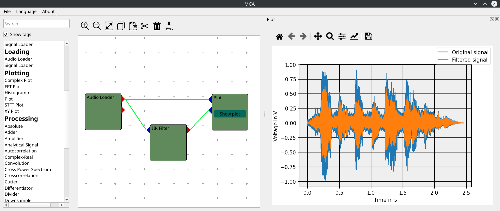

**********************
Multi Channel Analyzer
**********************

Graph based signal processing tool. Data is being passed between
blocks via inputs and outputs in a block diagram.
Allows sequential and parallel execution of various processing steps in a
easy and trivial manner.

Features
========

* Loading and saving block structure
* Graphical User Interface (PySide6)

  * Easy editing of blocks
  * Language Support
* Audio Support
* Support for Handyscope oscilloscope devices (HS3, HS5)

Installation
============

Stable release
^^^^^^^^^^^^^^

You can download stand-alone executables from `GitHub releases`_.
They include a bundled Python version, thus no further installations are
necessary.

If Python3.7 or greater is available on your system, you can also install the Multi Channel
Analyzer with pip:

.. code-block:: console

   $ pip install git+https://github.com/emtpb/mca.git

This will always install the most recent stable release.

If you don't have `pip`_ installed, this `Python installation guide`_ can guide
you through the process.
Note that on systems that still use legacy Python as the default, you will have
to use ``pip3`` instead of ``pip``.

Under Linux you need to install the PortAudio library which can be done via 
package manager:

.. code-block:: console

    $ sudo apt-get install libportaudio2

.. _GitHub releases: https://github.com/emtpb/mca/releases
.. _pip: https://pip.pypa.io
.. _Python installation guide: http://docs.python-guide.org/en/latest/starting/installation/

From sources
^^^^^^^^^^^^

The sources for Multi Channel Analyzer can be downloaded from the
`Github repo`_.

You can either clone the public repository:

.. code-block:: console

   $ git clone git://github.com/emtpb/mca

Or download the `tarball`_:

.. code-block:: console

   $ curl -OL https://github.com/emtpb/mca/tarball/master

Once you have a copy of the source, you can install it with:

.. code-block:: console

   $ python setup.py install

.. _Github repo: https://github.com/emtpb/mca
.. _tarball: https://github.com/emtpb/mca/tarball/master

Usage
=====

Most users will just start the GUI by launching the installed executable.

If installed via pip, call

.. code-block:: console

   $ mca

from the command line (if you have added your python scripts path to your 
PATH).
